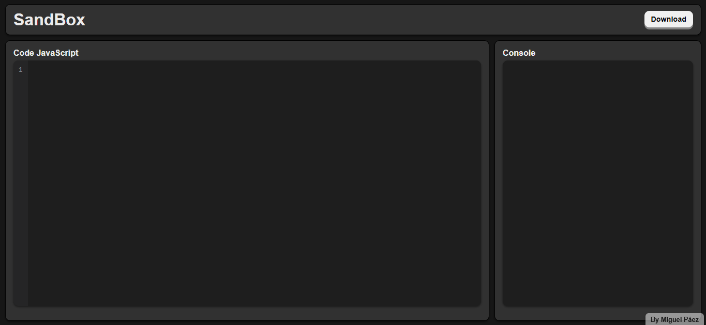
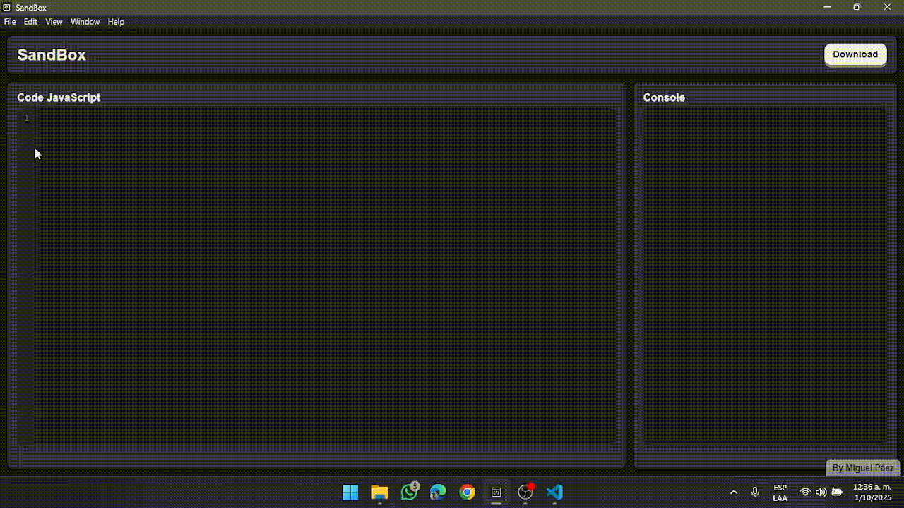
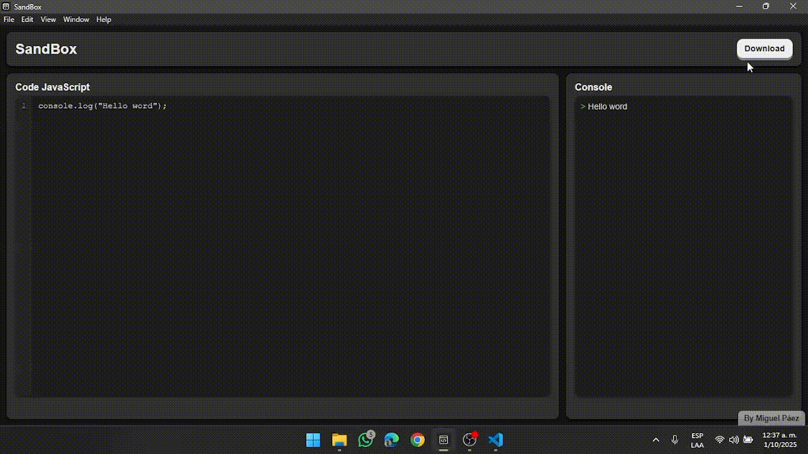

# 🖥️ SandBox

SandBox es una aplicación de escritorio construida con **Electron** que permite escribir, ejecutar y probar código JavaScript en tiempo real, con una interfaz sencilla y un entorno seguro tipo "sandbox".

---

## 🚀 Características
- Editor con numeración de líneas.
- Ejecución automática del código mientras escribes.
- Consola integrada que muestra resultados y errores.
- Descarga del código en un archivo `.js`.
- Icono y logo personalizados.
- Instalador para Windows (`.exe`) con acceso directo al escritorio.

---

## 📂 Estructura del proyecto
```
SandBox/
│── css/
│   └── style.css
│── js/
│   ├── app.js
│   └── download-code.js
│── img/
│   ├── app-icon.png
│   └── app-logo.png
│── index.html
│── main.js
│── preload.js
│── package.json
│── .gitignore
│── README.md
```

---

## 🛠️ Requisitos
- [Node.js](https://nodejs.org/) (v18 o superior recomendado)
- npm (instalado junto con Node.js)

---

## ⚡ Instalación y ejecución en modo desarrollo
1. Clona el repositorio:
   ```bash
   git clone https://github.com/MiguelPaez782/SandBox.git
   cd SandBox
   ```
2. Instala dependencias:
   ```bash
   npm install
   ```
3. Inicia la app en modo desarrollo:
   ```bash
   npm start
   ```

---

## 📦 Generar instalador de Windows
Para crear el instalador (`.exe`):
```bash
npm run dist
```

Esto generará los archivos en la carpeta `dist/`.

---

## 📸 Capturas

1. **Vista principal**
  
   
 

2. **Demo - Ejecutar código**
  
   


3. **Descarga del codigo .js**
 
   

---

## 🌟 Contribuye
Si te gusta esta app, deja una ⭐ en el repo y ayúdame a mejorarla con ideas o PRs.

---

## ✨ Autor

Creado por **Miguel Páez**
🔗 [GitHub](https://github.com/MiguelPaez782)

Siéntete libre de contribuir o modificarlo para tu uso personal.
